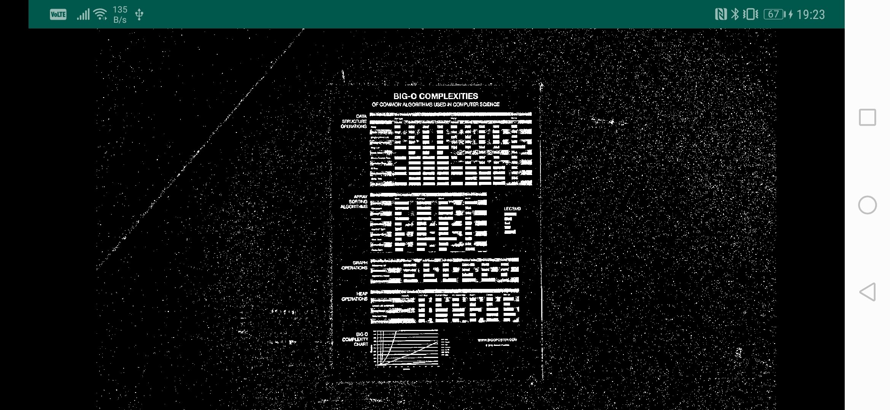

# Native OpenCV for Android with Android NDK

A tutorial for setting up OpenCV 4.4.0 for Android in [Android Studio](https://developer.android.com/studio) with Native Development Kit (NDK) support. 
[Android NDK](https://developer.android.com/ndk) enables you to implement your [OpenCV](https://opencv.org) image processing pipeline in C++ and call that C++ code from Android Kotlin/Java code through JNI ([Java Native Interface](https://en.wikipedia.org/wiki/Java_Native_Interface)).

This sample Android application displays a live camera feed with an OpenCV *adaptive threshold* filter applied on each frame. The OpenCV *adaptive threshold* call is performed in C++.

## Setup

| Tool      | Version |
| ---       |  ---    |
| [OpenCV](https://opencv.org) | 4.4.0
| [Android Studio](https://developer.android.com/studio) | 4.0.1
| [Android Build Tool](https://developer.android.com/about) | 29.0.3
| [Android NDK](https://developer.android.com/ndk/guides) | r21d
| [Kotlin](https://kotlinlang.org/docs/reference/) | 1.3.72
| [Gradle](https://gradle.org) | 6.1.1
| Mac OS | 10.15.6

## How to use this repository

1. [Download and Install Android Studio](https://developer.android.com/studio)
 
2. [Install NDK, CMake and LLDB](https://developer.android.com/studio/projects/install-ndk.md)
 
3. Clone this repository as an Android Studio project :
     * In Android Studio, click on `File -> New -> Project from Version Control -> Git`
     * Paste this repository *Github URL*, choose a *project directory* and click next.
     
4. Install *OpenCV Android release* :
    * Download [OpenCV 4.4.0 Android release](https://sourceforge.net/projects/opencvlibrary/files/4.4.0/opencv-4.4.0-android-sdk.zip/download) or download latest available Android release on [OpenCV website](https://opencv.org/releases/).
    * Unzip downloaded file and put **OpenCV-android-sdk** directory on a path of your choice.
 
5. Link your *Android Studio* project to the *OpenCV Android SDK* you just downloaded :
    * Open [gradle.properties](gradle.properties) file and edit following line with your own *OpenCV Android SDK* directory path :
    
          opencvsdk=/Users/Example/Downloads/OpenCV-android-sdk
          
6. Sync Gradle and run the application on your Android Device!

Note: MainActivity is written in Kotlin but you can comment out the [Kotlin](/app/src/main/kotlin/com/example/nativeopencvandroidtemplate/MainActivity.kt) file and uncomment the [Java](/app/src/main/java/com/example/nativeopencvandroidtemplate/MainActivity.java) file to use Java.

## Bootstrap a new Android project with Native OpenCV support

Here are the steps to follow to create a new Android Studio project with native OpenCV support :

1. [Download and Install Android Studio](https://developer.android.com/studio)

2. [Install NDK, CMake and LLDB](https://developer.android.com/studio/projects/install-ndk.md)

3. Create a new *Native Android Studio project* :
    * Select `File -> New -> New Project...` from the main menu.
    * Click `Phone and Tablet tab`, select `Native C++` and click next.
    * Choose an `Application Name`, select your favorite `language` (Kotlin or Java), choose `Minimum API level` (28 here) and select next.
    * Choose `Toolchain default` as *C++ standard* and click Finish.
    
4. Install *OpenCV Android release* :
    * Download [OpenCV 4.4.0 Android release](https://sourceforge.net/projects/opencvlibrary/files/4.4.0/opencv-4.4.0-android-sdk.zip/download) or download latest available Android release on [OpenCV website](https://opencv.org/releases/).
    * Unzip downloaded file and put **OpenCV-android-sdk** directory on a path of your choice.
    
5. Add *OpenCV Android SDK* as a module into your project :
    * Open [setting.gradle](settings.gradle) file and append these two lines.
    
          include ':opencv'
          project(':opencv').projectDir = new File(opencvsdk + '/sdk')
        
    * Open [gradle.properties](gradle.properties) file and append following line. Do not forget to use correct *OpenCV Android SDK* path for your machine. 
    
          opencvsdk=/Users/Example/Downloads/OpenCV-android-sdk
          
    * Open [build.gradle](app/build.gradle) file and add `implementation project(path: ':opencv')` to dependencies section :
    
          dependencies {
              ...
              implementation project(path: ':opencv')
          }
    
    * Click on `File -> Sync Project with Gradle Files`.
    
6. Add following config to app [build.gradle](app/build.gradle) file :
    * In `android -> defaultConfig -> externalNativeBuild -> cmake` section, put these three lines :
    
          cppFlags "-frtti -fexceptions"
          abiFilters 'x86', 'x86_64', 'armeabi-v7a', 'arm64-v8a'
          arguments "-DOpenCV_DIR=" + opencvsdk + "/sdk/native"
        
7. Add following config to [CMakeLists.txt](app/src/main/cpp/CMakeLists.txt) file :
    * Before `add_library` instruction, add three following lines :
    
          include_directories(${OpenCV_DIR}/jni/include)
          add_library( lib_opencv SHARED IMPORTED )
          set_target_properties(lib_opencv PROPERTIES IMPORTED_LOCATION ${OpenCV_DIR}/libs/${ANDROID_ABI}/libopencv_java4.so)
        
    * In `target_link_libraries` instruction arguments, add following line :
    
          lib_opencv
        
8. Add following *permissions* to your [AndroidManifest.xml](app/src/main/AndroidManifest.xml) file :

       <uses-permission android:name="android.permission.CAMERA"/>
       <uses-feature android:name="android.hardware.camera"/>
       <uses-feature android:name="android.hardware.camera.autofocus"/>
       <uses-feature android:name="android.hardware.camera.front"/>
       <uses-feature android:name="android.hardware.camera.front.autofocus"/>
    
9. Create your *MainActivity* :
    * You can copy paste MainActivity [Kotlin](/app/src/main/kotlin/com/example/nativeopencvandroidtemplate/MainActivity.kt) or [Java](/app/src/main/java/com/example/nativeopencvandroidtemplate/MainActivity.java) file. Do not forget to adapt package name.
    
10. Create your *activity_main.xml* :
    * You can copy paste [activity_main.xml](/app/src/main/res/layout/activity_main.xml) file.
    
11. Add native code in *native-lib.cpp* :
    * You can copy paste [native-lib.cpp](app/src/main/cpp/native-lib.cpp) file. Do not forget to adapt the method name : 
    `Java_com_example_nativeopencvtemplate_MainActivity_adaptiveThresholdFromJNI`
    should be replaced with 
    `Java_<main-activity-package-name-with-underscores>_MainActivity_adaptiveThresholdFromJNI`.
    
12. Sync Gradle and run the application on your Android Device!

## Questions and Remarks

If you have any question or remark regarding this tutorial, feel free to open an issue.

## Acknowledgments

This tutorial was inspired by this very good [Github repository](https://github.com/leadrien/opencv_native_androidstudio).

## Keywords

Tutorial, Template, OpenCV 4.4.0, Android, Android Studio, Native, NDK, Native Development Kit, JNI, Java Native Interface, C++, Kotlin, Java
